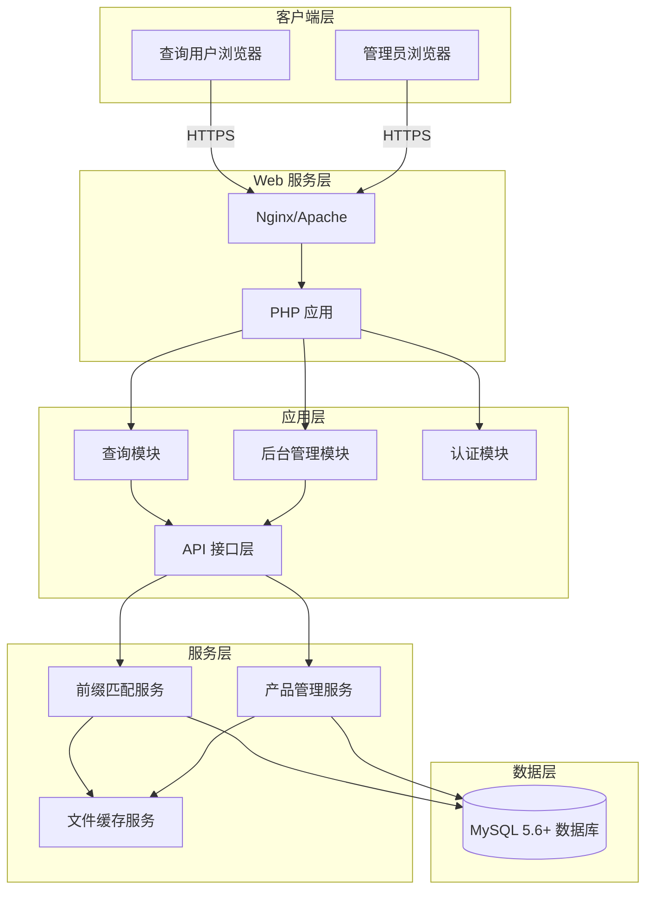
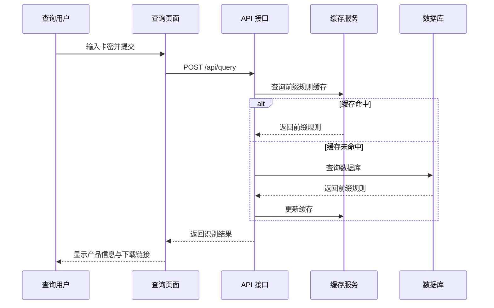
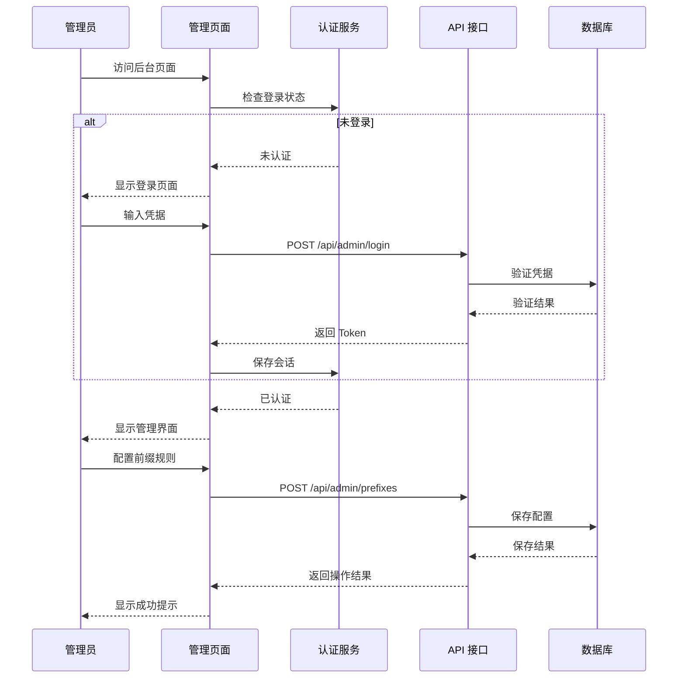
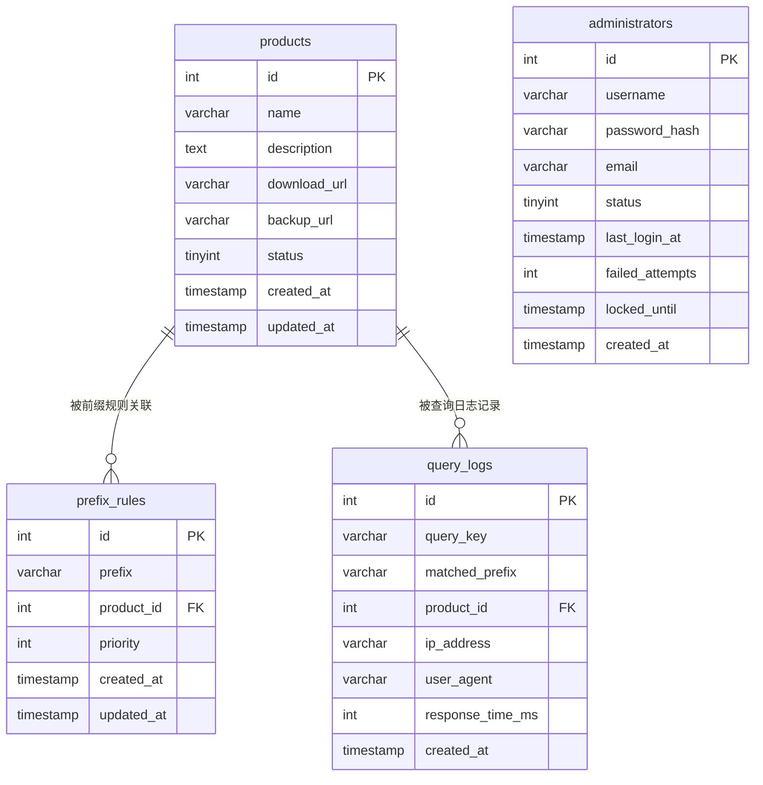
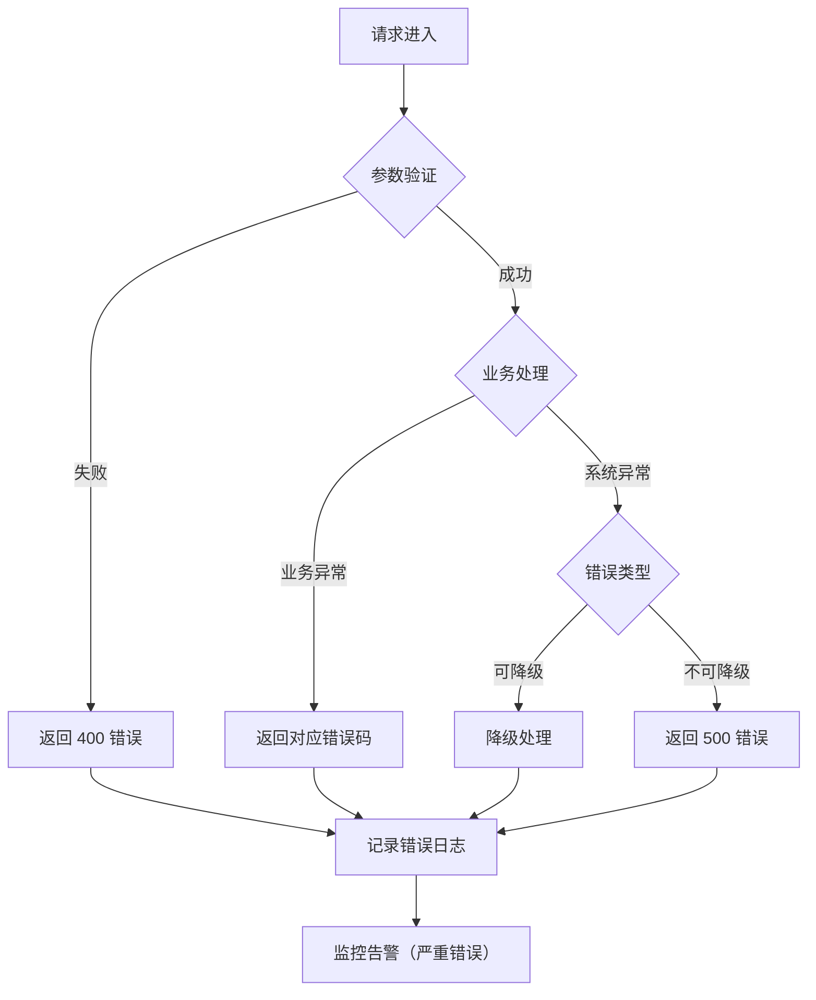
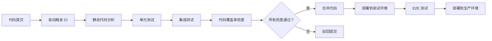

# PHP 卡密识别系统设计文档

Feature Name: license-key-recognition
Updated: 2026-06-07

## Description

本系统为 PHP 卡密识别系统，提供公开查询页面和后台管理界面。用户通过输入卡密，系统自动识别卡密前缀并显示对应的产品名称与下载链接。管理员可在后台配置卡密前缀规则、管理产品信息和下载链接。系统采用前后端分离架构，使用 MySQL 数据库存储数据，支持动态前缀匹配和实时配置更新。

## 技术栈要求

- **PHP 版本**: 7.4+
- **MySQL 版本**: 5.6+
- **Web 服务器**: Apache 2.4+ / Nginx 1.14+
- **浏览器要求**: 支持 HTML5 和 ES6 的现代浏览器

### PHP 7.4+ 特性使用

- 类型声明（Type Declarations）- 严格模式
- 箭头函数（Arrow Functions）
- 联合类型（PHP 8 可选，PHP 7.4 使用 docblock 注解）
- PDO 预处理语句防止 SQL 注入
- session 管理用于后台认证

### MySQL 5.6+ 兼容性

- 使用 InnoDB 存储引擎
- 支持事务和外键约束
- 字符集：utf8mb4
- 时间精度：秒级（不使用微秒）

## Architecture

### 系统整体架构



**架构说明**：
- 不依赖 Redis，使用 PHP 文件缓存和内存数组缓存
- 适合 PHP 7.4 + MySQL 5.6 的经典 LAMP/LNMP 环境
- 所有逻辑使用 PHP 原生实现，无框架依赖

### 请求处理流程



### 后台管理流程



## Components and Interfaces

### 1. 查询模块（Query Module）

**职责**：处理用户卡密查询请求，执行前缀匹配并返回产品信息

**接口**：
- `POST /api/query` - 卡密识别接口
  - 输入：`{ key: string }`
  - 输出：`{ success: boolean, product: Product|null, message: string }`

**依赖**：
- 前缀匹配服务
- 缓存服务

**实现要点**：
- 采用最长前缀匹配算法
- 支持异步查询提升响应速度
- 对输入卡密进行长度验证和字符过滤

### 2. 后台管理模块（Admin Module）

**职责**：提供后台管理界面，处理管理员的配置操作

**子模块**：
- 前缀规则管理界面
- 产品管理界面
- 下载链接管理界面

**接口**：
- `GET /admin` - 后台管理首页
- `GET /admin/prefixes` - 前缀规则管理页面
- `GET /admin/products` - 产品管理页面

### 3. 认证模块（Authentication Module）

**职责**：处理管理员身份认证和会话管理

**接口**：
- `POST /api/admin/login` - 管理员登录
  - 输入：`{ username: string, password: string }`
  - 输出：`{ success: boolean, token: string, expires: number }`
- `POST /api/admin/logout` - 管理员登出
- `GET /api/admin/me` - 获取当前管理员信息

**依赖**：
- 数据库（管理员账户表）
- Session/Token 管理服务

**安全要求**：
- 密码使用 bcrypt 加密存储（cost >= 12）
- Token 使用 JWT 或 Session ID
- 会话超时时间：30 分钟
- 登录失败锁定：5 次失败后锁定 15 分钟

### 4. API 接口层（API Layer）

**职责**：提供 RESTful API 接口，处理前后端数据交互

**接口规范**：
- 统一使用 JSON 格式
- HTTPS 传输（生产环境）
- 标准 HTTP 状态码
- 统一错误响应格式

**公共响应格式**：
```json
{
  "success": true,
  "data": {},
  "message": "操作成功"
}
```

**错误响应格式**：
```json
{
  "success": false,
  "error": {
    "code": "ERROR_CODE",
    "message": "错误描述"
  }
}
```

### 5. 前缀匹配服务（Prefix Matching Service）

**职责**：执行卡密前缀匹配算法，支持动态长度前缀

**算法**：
1. 从最长可能前缀开始尝试匹配
2. 逐步缩短前缀长度直到找到匹配或长度为 0
3. 返回匹配的产品信息

**伪代码**：
```php
function matchPrefix(string $key): ?Product {
    $maxLength = strlen($key);
    for ($length = $maxLength; $length >= 1; $length--) {
        $prefix = substr($key, 0, $length);
        if ($product = findProductByPrefix($prefix)) {
            return $product;
        }
    }
    return null;
}
```

**性能优化**：
- 使用前缀树（Trie）数据结构加速匹配
- 缓存热点前缀规则
- 支持正则表达式前缀（可选扩展）

### 6. 产品管理服务（Product Management Service）

**职责**：管理产品信息的增删改查

**接口**：
- `GET /api/admin/products` - 获取产品列表
- `POST /api/admin/products` - 创建产品
- `PUT /api/admin/products/{id}` - 更新产品
- `DELETE /api/admin/products/{id}` - 删除产品

**业务规则**：
- 产品名称唯一性校验
- 删除前检查关联前缀规则
- 支持产品启用/禁用状态

### 7. 文件缓存服务（File Cache Service）

**职责**：使用文件缓存前缀规则和产品数据，提升查询性能（兼容 PHP 7.4 + MySQL 5.6，不依赖 Redis）

**缓存策略**：
- 全量缓存：每次查询时从文件加载所有前缀规则到内存数组
- 增量更新：配置变更时重新生成缓存文件
- 失效策略：缓存文件有效期 300 秒，超时后自动重建
- 文件锁：使用 `flock()` 保证并发安全

**缓存目录**：`/cache/` 目录下生成 `prefix_rules.cache.php`

**缓存数据结构**：
```php
<?php
// cache/prefix_rules.cache.php
return [
    'version' => 1234567890,  // 时间戳，用于版本控制
    'prefixes' => [
        'ABC' => ['product_id' => 1, 'priority' => 1],
        'AB' => ['product_id' => 2, 'priority' => 2],
    ],
    'products' => [
        1 => ['id' => 1, 'name' => '产品 A', 'download_url' => '...'],
        2 => ['id' => 2, 'name' => '产品 B', 'download_url' => '...'],
    ]
];
```

**PHP 7.4 实现要点**：
- 使用 `require` 加载缓存文件（比 `file_get_contents` + `json_decode` 更快）
- 使用 `file_put_contents()` + `LOCK_EX` 保证写入原子性
- 缓存文件使用 PHP 数组格式，避免 JSON 编解码开销

## Data Models

### 数据库表设计

**MySQL 5.6+ 兼容性说明**：
- 存储引擎：InnoDB（支持事务和外键）
- 字符集：utf8mb4（兼容 emoji 和特殊字符）
- 排序规则：utf8mb4_general_ci
- 时间字段：使用 DATETIME 替代 TIMESTAMP（避免 2038 问题）

#### 1. 产品表（products）

| 字段 | 类型 | 约束 | 说明 |
|------|------|------|------|
| id | INT(11) | PRIMARY KEY, AUTO_INCREMENT | 产品 ID |
| name | VARCHAR(255) | NOT NULL, UNIQUE KEY | 产品名称 |
| description | TEXT | NULL | 产品描述 |
| download_url | VARCHAR(512) | NOT NULL | 主下载链接 |
| backup_url | VARCHAR(512) | NULL | 备用下载链接 |
| status | TINYINT(1) | DEFAULT 1 | 状态：1=启用，0=禁用 |
| created_at | DATETIME | DEFAULT CURRENT_TIMESTAMP | 创建时间 |
| updated_at | DATETIME | NULL ON UPDATE CURRENT_TIMESTAMP | 更新时间 |

**建表语句**：
```sql
CREATE TABLE products (
    id INT(11) AUTO_INCREMENT PRIMARY KEY,
    name VARCHAR(255) NOT NULL UNIQUE,
    description TEXT NULL,
    download_url VARCHAR(512) NOT NULL,
    backup_url VARCHAR(512) NULL,
    status TINYINT(1) DEFAULT 1,
    created_at DATETIME DEFAULT CURRENT_TIMESTAMP,
    updated_at DATETIME NULL ON UPDATE CURRENT_TIMESTAMP
) ENGINE=InnoDB DEFAULT CHARSET=utf8mb4 COLLATE=utf8mb4_general_ci;
```

#### 2. 前缀规则表（prefix_rules）

| 字段 | 类型 | 约束 | 说明 |
|------|------|------|------|
| id | INT(11) | PRIMARY KEY, AUTO_INCREMENT | 规则 ID |
| prefix | VARCHAR(100) | NOT NULL, UNIQUE KEY | 卡密前缀 |
| product_id | INT(11) | NOT NULL, FOREIGN KEY | 关联产品 ID |
| priority | INT(11) | DEFAULT 0 | 优先级（数字越大优先级越高） |
| created_at | DATETIME | DEFAULT CURRENT_TIMESTAMP | 创建时间 |
| updated_at | DATETIME | NULL ON UPDATE CURRENT_TIMESTAMP | 更新时间 |

**索引**：
- UNIQUE KEY uk_prefix (prefix) - 前缀唯一索引
- KEY idx_product_id (product_id) - 外键索引

**建表语句**：
```sql
CREATE TABLE prefix_rules (
    id INT(11) AUTO_INCREMENT PRIMARY KEY,
    prefix VARCHAR(100) NOT NULL UNIQUE,
    product_id INT(11) NOT NULL,
    priority INT(11) DEFAULT 0,
    created_at DATETIME DEFAULT CURRENT_TIMESTAMP,
    updated_at DATETIME NULL ON UPDATE CURRENT_TIMESTAMP,
    CONSTRAINT fk_prefix_product FOREIGN KEY (product_id) REFERENCES products(id) ON DELETE CASCADE
) ENGINE=InnoDB DEFAULT CHARSET=utf8mb4 COLLATE=utf8mb4_general_ci;
```

#### 3. 管理员表（administrators）

| 字段 | 类型 | 约束 | 说明 |
|------|------|------|------|
| id | INT(11) | PRIMARY KEY, AUTO_INCREMENT | 管理员 ID |
| username | VARCHAR(50) | NOT NULL, UNIQUE KEY | 用户名 |
| password_hash | VARCHAR(255) | NOT NULL | 密码哈希（bcrypt） |
| email | VARCHAR(255) | NULL | 邮箱 |
| status | TINYINT(1) | DEFAULT 1 | 状态：1=启用，0=禁用 |
| last_login_at | DATETIME | NULL | 最后登录时间 |
| failed_attempts | INT(11) | DEFAULT 0 | 连续失败次数 |
| locked_until | DATETIME | NULL | 锁定截止时间 |
| created_at | DATETIME | DEFAULT CURRENT_TIMESTAMP | 创建时间 |

**建表语句**：
```sql
CREATE TABLE administrators (
    id INT(11) AUTO_INCREMENT PRIMARY KEY,
    username VARCHAR(50) NOT NULL UNIQUE,
    password_hash VARCHAR(255) NOT NULL,
    email VARCHAR(255) NULL,
    status TINYINT(1) DEFAULT 1,
    last_login_at DATETIME NULL,
    failed_attempts INT(11) DEFAULT 0,
    locked_until DATETIME NULL,
    created_at DATETIME DEFAULT CURRENT_TIMESTAMP
) ENGINE=InnoDB DEFAULT CHARSET=utf8mb4 COLLATE=utf8mb4_general_ci;
```

#### 4. 查询日志表（query_logs）

| 字段 | 类型 | 约束 | 说明 |
|------|------|------|------|
| id | BIGINT(20) | PRIMARY KEY, AUTO_INCREMENT | 日志 ID |
| query_key | VARCHAR(255) | NOT NULL | 查询的卡密（脱敏） |
| matched_prefix | VARCHAR(100) | NULL | 匹配的前缀 |
| product_id | INT(11) | NULL | 匹配的产品 ID |
| ip_address | VARCHAR(45) | NOT NULL | 用户 IP（IPv4/IPv6） |
| user_agent | VARCHAR(512) | NULL | 用户代理 |
| response_time_ms | INT(11) | NOT NULL | 响应时间（毫秒） |
| created_at | DATETIME | DEFAULT CURRENT_TIMESTAMP | 查询时间 |

**索引**：
- KEY idx_created_at (created_at) - 时间范围查询优化
- KEY idx_product_id (product_id) - 产品统计查询优化

**建表语句**：
```sql
CREATE TABLE query_logs (
    id BIGINT(20) AUTO_INCREMENT PRIMARY KEY,
    query_key VARCHAR(255) NOT NULL,
    matched_prefix VARCHAR(100) NULL,
    product_id INT(11) NULL,
    ip_address VARCHAR(45) NOT NULL,
    user_agent VARCHAR(512) NULL,
    response_time_ms INT(11) NOT NULL,
    created_at DATETIME DEFAULT CURRENT_TIMESTAMP,
    KEY idx_created_at (created_at),
    KEY idx_product_id (product_id)
) ENGINE=InnoDB DEFAULT CHARSET=utf8mb4 COLLATE=utf8mb4_general_ci;
```

### 实体关系图



## Correctness Properties

### 不变量（Invariants）

1. **前缀唯一性**：任意时刻，prefix_rules 表中不存在相同的 prefix 值
2. **产品引用完整性**：删除产品前必须先删除或重新关联所有引用该产品的前缀规则
3. **查询响应时间**：99% 的查询请求响应时间 < 1 秒（在正常负载下）
4. **缓存一致性**：数据库配置变更后，缓存应在 5 秒内完成同步
5. **会话安全**：管理员会话 Token 在 30 分钟后自动失效

### 边界条件处理

1. **空卡密输入**：返回错误提示"请输入有效的卡密"
2. **超长卡密**：截断前 200 个字符进行匹配，避免性能问题
3. **特殊字符**：过滤非 ASCII 字符，仅保留字母数字和常见符号
4. **并发写入**：使用数据库事务保证配置变更的原子性
5. **缓存穿透**：未匹配到前缀时缓存空结果 5 分钟，防止恶意查询

### 性能约束

1. **并发能力**：支持 100 QPS 查询请求
2. **数据库连接**：最大连接数 50，连接池复用
3. **缓存命中率**：前缀规则缓存命中率 > 95%
4. **内存使用**：缓存占用内存 < 100MB（10000 条规则内）

## Error Handling

### 错误分类与处理策略

#### 1. 用户输入错误（4xx）

| 错误场景 | HTTP 状态码 | 错误代码 | 处理策略 |
|----------|------------|----------|----------|
| 卡密为空 | 400 | VALIDATION_ERROR | 返回友好提示信息 |
| 卡密格式无效 | 400 | VALIDATION_ERROR | 提示输入有效格式 |
| 前缀重复 | 409 | CONFLICT_ERROR | 提示前缀已存在 |
| 产品不存在 | 404 | NOT_FOUND_ERROR | 返回 404 页面 |
| 未授权访问 | 401 | UNAUTHORIZED_ERROR | 跳转到登录页 |
| 权限不足 | 403 | FORBIDDEN_ERROR | 显示权限不足提示 |

#### 2. 系统错误（5xx）

| 错误场景 | HTTP 状态码 | 错误代码 | 处理策略 |
|----------|------------|----------|----------|
| 数据库连接失败 | 503 | DATABASE_ERROR | 显示维护页面，记录日志 |
| 缓存服务异常 | 503 | CACHE_ERROR | 降级到数据库查询 |
| 内存溢出 | 503 | MEMORY_ERROR | 重启服务，发送告警 |
| 未知异常 | 500 | INTERNAL_ERROR | 记录详细日志，返回通用错误 |

### 错误处理流程



### 日志记录策略

1. **查询日志**：记录所有查询请求（卡密脱敏）、匹配结果、响应时间
2. **操作日志**：记录管理员所有配置变更操作
3. **错误日志**：记录所有异常堆栈和上下文信息
4. **访问日志**：记录所有 HTTP 请求的访问时间、IP、UA

### 告警机制

- **数据库连接失败**：立即发送告警（短信/邮件）
- **错误率超过阈值**：5 分钟内错误率 > 5% 时发送告警
- **响应时间超时**：平均响应时间 > 2 秒持续 10 分钟时发送告警
- **磁盘空间不足**：磁盘使用率 > 80% 时发送告警

## Test Strategy

### 测试层次

#### 1. 单元测试（Unit Test）

**覆盖范围**：
- 前缀匹配算法
- 数据验证逻辑
- 工具函数
- 服务层业务逻辑

**测试框架**：PHPUnit

**示例用例**：
```php
// 前缀匹配测试
test('matchPrefix returns correct product for exact match', function() {
    $result = matchPrefix('ABC123');
    expect($result->name)->toBe('产品 A');
});

test('matchPrefix uses longest prefix rule', function() {
    // ABC -> 产品 A, AB -> 产品 B
    $result = matchPrefix('ABXYZ');
    expect($result->name)->toBe('产品 B'); // 应匹配 AB 而非 A
});

test('matchPrefix returns null for unmatched key', function() {
    $result = matchPrefix('UNKNOWN');
    expect($result)->toBeNull();
});
```

#### 2. 集成测试（Integration Test）

**覆盖范围**：
- API 接口测试
- 数据库交互测试
- 缓存服务测试
- 认证流程测试

**测试工具**：PHPUnit + TestContainer

**示例用例**：
```php
// API 接口测试
test('POST /api/query returns product info', function() {
    $response = $this->post('/api/query', ['key' => 'ABC123']);
    $response->assertStatus(200)
             ->assertJson(['success' => true])
             ->assertJsonPath('data.product.name', '产品 A');
});

test('POST /api/admin/login with invalid credentials', function() {
    $response = $this->post('/api/admin/login', [
        'username' => 'admin',
        'password' => 'wrong'
    ]);
    $response->assertStatus(401)
             ->assertJson(['success' => false]);
});
```

#### 3. 端到端测试（E2E Test）

**覆盖范围**：
- 用户查询完整流程
- 管理员配置完整流程
- 前后端联调测试

**测试工具**：Playwright / Selenium

**测试场景**：
1. 查询流程：打开页面 → 输入卡密 → 提交 → 验证结果显示
2. 登录流程：打开后台 → 输入凭据 → 登录 → 验证管理界面
3. 配置流程：登录后台 → 添加产品 → 添加前缀 → 验证查询结果

#### 4. 性能测试（Performance Test）

**测试目标**：
- 单接口响应时间 < 1 秒（P99）
- 支持 100 并发用户
- 缓存命中率 > 95%

**测试工具**：Apache JMeter / k6

**测试场景**：
```yaml
# k6 性能测试脚本示例
export default function() {
  // 查询接口压测
  http.post('/api/query', JSON.stringify({key: 'TEST123'}));
  
  // 并发测试
  group('concurrent queries', () => {
    for (let i = 0; i < 100; i++) {
      http.post('/api/query', JSON.stringify({key: `KEY${i}`}));
    }
  });
}
```

#### 5. 安全测试（Security Test）

**测试范围**：
- SQL 注入防护
- XSS 攻击防护
- CSRF 防护
- 暴力破解防护
- 会话管理安全

**测试工具**：OWASP ZAP / Burp Suite

**测试用例**：
1. SQL 注入：输入 `' OR '1'='1` 验证查询接口
2. XSS 攻击：输入 `<script>alert(1)</script>` 验证输出转义
3. 暴力破解：连续 10 次错误密码验证账户锁定
4. 会话劫持：使用过期 Token 验证访问被拒绝

### 测试覆盖率要求

| 代码类型 | 覆盖率要求 |
|----------|-----------|
| 业务逻辑代码 | >= 80% |
| 核心算法（前缀匹配） | >= 95% |
| API 接口层 | >= 90% |
| 数据访问层 | >= 85% |

### 持续集成流程



### 测试数据管理

1. **测试数据库**：使用独立测试数据库，与生产环境隔离
2. **测试数据清理**：每次测试后回滚事务或重置数据库
3. **测试数据生成**：使用 Factory 模式生成测试数据
4. **敏感数据脱敏**：生产数据导出测试时需脱敏处理

## References

[^1]: (EARS 需求规范) - Easy Approach to Requirements Syntax 官方文档
[^2]: (INCOSE 质量标准) - INCOSE Systems Engineering Handbook
[^3]: (PHP 最佳实践) - PHP: The Right Way (https://phptherightway.com)
[^4]: (RESTful API 设计) - REST API Design Best Practices
[^5]: (MySQL 性能优化) - MySQL High Availability and Performance
[^6]: (Redis 缓存策略) - Redis Documentation (https://redis.io/documentation)
